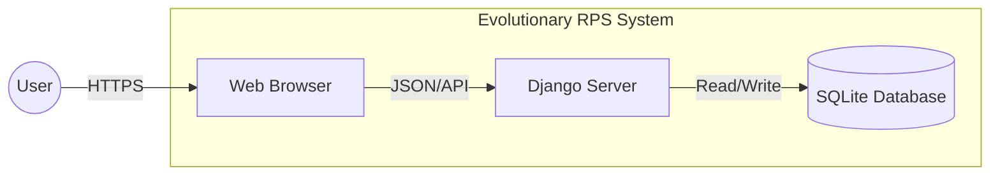
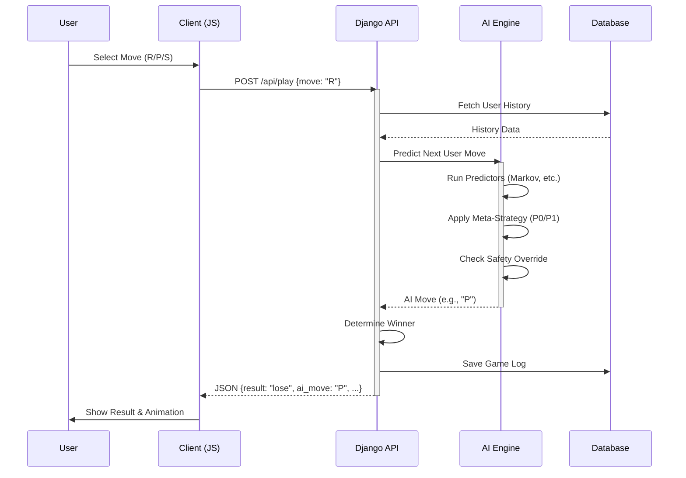
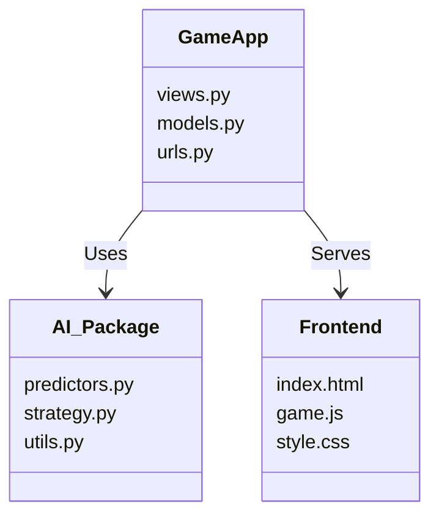

# アーキテクチャ設計書

## 1. システムコンテキスト (System Context)

本システム「Evolutionary RPS」は、ユーザー（ブラウザ）とサーバー（Django）が対話するWebアプリケーションである。



## 2. コンテナ図 (Container Diagram)

サーバーサイドの内部構成と、AIエンジンの配置を示す。

```mermaid
graph TB
    subgraph "Client Side"
        UI[Frontend UI\n(HTML/JS/Tailwind)]
    end

    subgraph "Server Side (Django)"
        API[API Views\n(views.py)]
        GameLogic[Game Logic]
        
        subgraph "AI Engine"
            Selector[Strategy Selector]
            Predictors[Predictors\n(Markov, Pattern, etc.)]
            Safety[Safety Mechanisms]
        end
        
        Models[ORM Models]
    end
    
    DB[(SQLite)]

    UI -->|POST /api/play| API
    UI -->|POST /api/reset| API
    
    API --> GameLogic
    GameLogic --> Selector
    Selector --> Safety
    Safety --> Predictors
    
    GameLogic --> Models
    Models --> DB
```

## 3. シーケンス図: 対戦フロー (Game Flow)

ユーザーが手を出し、AIが予測して結果を返すまでの流れ。



## 4. ディレクトリ構造と責務



## 5. 技術スタックサマリ

| Layer | Technology | Version |
| :--- | :--- | :--- |
| **Frontend** | HTML5, Vanilla JS, Tailwind CSS | Latest |
| **Backend** | Python, Django | **5.2 LTS** |
| **Database** | SQLite | 3.x |
| **AI Logic** | Python (NumPy optional) | - |
| **Infra** | PythonAnywhere | - |
